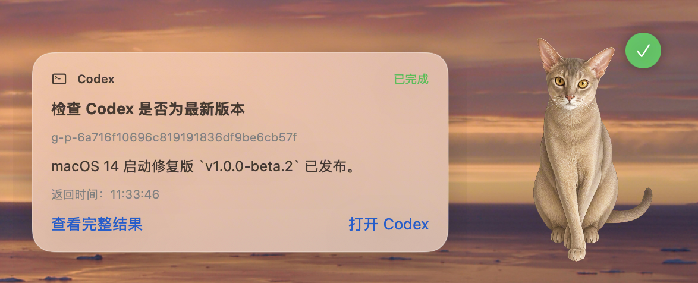

# Abigent

Abigent 是一个完全在本地运行的 macOS Codex 桌面伴侣。它用一只桌面小猫反馈 Agent 的工作、等待操作和完成状态，并在任务完成后展示本轮回复摘要。

> [!IMPORTANT]
> **当前推荐版本：[`v1.0.0-beta.2`](https://github.com/100656cyx/Abigent/releases/tag/v1.0.0-beta.2)**
>
> Beta 1 存在 macOS 14 启动兼容问题，请下载 Beta 2。

[下载 Abigent v1.0.0-beta.2 DMG](https://github.com/100656cyx/Abigent/releases/download/v1.0.0-beta.2/Abigent-1.0.0-beta.2-macOS-arm64.dmg) · [查看发布说明](https://github.com/100656cyx/Abigent/releases/tag/v1.0.0-beta.2)



> 当前版本是免费个人分享 Beta，使用临时签名，尚未使用 Apple Developer ID 公证。首次打开需要在 macOS“系统设置 → 隐私与安全性”中点击“仍要打开”。

## 主要能力

- 自动监听 Codex 桌面应用的实时任务状态。
- 任务完成后悬停小猫，查看本轮摘要、返回时间、文件与测试信息。
- 小猫主窗口固定；摘要和操作框使用独立浮层，不会在悬停时移动小猫。
- 只有按住小猫拖动时才改变桌面位置，位置会自动保存。
- 触控板双指点按或鼠标右键打开操作框。
- 使用操作框中的滑块将小猫调整为 50%–150%，大小自动保存。
- 仅在“需要你操作”和“任务完成”时发送系统通知。
- 安全合并 Codex Hooks，与 Flux Island 等已有 Hook 共存。
- 所有会话内容仅在本机处理，不需要 Abigent 账号或云服务。

## 系统要求

- Apple Silicon Mac（M1 或更新）
- macOS 14.0 或更新
- 已安装 Codex 桌面应用

当前 Beta 不包含 Intel 版本，也不支持 Windows。

## 下载与安装

从 GitHub Releases 下载：

- `Abigent-1.0.0-beta.2-macOS-arm64.dmg`
- 可选校验文件：`Abigent-1.0.0-beta.2-macOS-arm64.dmg.sha256`

安装步骤：

1. 打开 DMG，将 Abigent 拖入“应用程序”。
2. 尝试打开 Abigent；如果 macOS 阻止运行，关闭提示。
3. 打开“系统设置 → 隐私与安全性”，在 Abigent 的提示旁点击“仍要打开”。
4. 再次确认“打开”。这个确认通常只需要一次。
5. 在首次设置中启用实时同步。
6. 使用 `⌘Q` 完全退出 Codex，再重新打开并发送一个任务。

不要关闭 Gatekeeper，也不要使用删除 quarantine 属性的命令。完整说明见 [INSTALL.md](INSTALL.md)，DMG 内也附带《首次打开说明》。Apple 官方的免费个人软件打开流程见[安全打开 Mac App](https://support.apple.com/zh-cn/102445)。

## 使用小猫

- 移动：按住小猫主体拖动。
- 查看摘要：鼠标悬停小猫。
- 操作框：触控板双指点按或鼠标右键。
- 缩放：在操作框中使用 50%–150% 大小滑块。
- 复原：操作框点击“复原”，回到 100%。
- 隐藏后恢复：从菜单栏 Abigent 设置重新打开“显示桌面宠物”。

## 隐私

- 不需要注册 Abigent 账号。
- 不上传 Prompt、回复、文件列表或任务状态。
- 任务数据库与 Hook Socket 都保存在当前 Mac。
- Abigent 只维护带有 `com.abigent.desktop` 标记的 Hook 条目。

详见 [PRIVACY.md](PRIVACY.md)。

## 故障排查

- **小猫没有动作**：确认已启用实时同步，并使用 `⌘Q` 完整重启 Codex。
- **Hooks 已配置、Flux Island 正常，但 Abigent 不同步**：在 Codex 的 Hooks 设置中，逐项信任并启用命令包含 `Abigent.app/Contents/Helpers/abigent-hook` 的 handler，然后用 `⌘Q` 完全重启 Codex并发送一个新任务。第三方 Hook 已获信任，不代表同组的 Abigent handler 也已获信任。
- **首次打开被拦截**：先尝试打开一次，再到“隐私与安全性”点击“仍要打开”。
- **一直转圈**：等待 Codex 当前任务真正结束；若长时间没有变化，重启 Abigent 后新发一轮任务。
- **没有摘要**：确认 Codex 已产生本轮最终回复，并使用最新 Beta。
- **小猫不见了**：从菜单栏 Abigent 设置打开“显示桌面宠物”。
- **重新配置 Hook**：在设置中使用修复配置；非 Abigent Hook 会被保留。

## 卸载

先在 Abigent 设置中点击“停用 Abigent Hook”，再退出并删除应用。

可选本地数据：

- `~/Library/Application Support/Abigent/`
- `~/.abigent/`
- `~/.codex/hooks.abigent.backup.json`

## 本地开发

推荐完整 Xcode 和 Swift 6：

```bash
swift test
Scripts/build-app.sh
ABIGENT_VERSION=1.0.0-beta.2 ABIGENT_BUILD=7 Scripts/release.sh
```

生成的 App、DMG 和 SHA-256 位于 `dist/`。该目录不会提交到 Git。

## 项目文档

- [安装指南](INSTALL.md)
- [隐私说明](PRIVACY.md)
- [更新记录](CHANGELOG.md)
- [贡献指南](CONTRIBUTING.md)
- [Codex Hook 信任排障](docs/troubleshooting/codex-hook-trust.md)
- [1.0.0 Beta 2 发布说明](docs/releases/1.0.0-beta.2.md)
- [1.0.0 Beta 1 发布说明](docs/releases/1.0.0-beta.1.md)

## License

[MIT](LICENSE)
